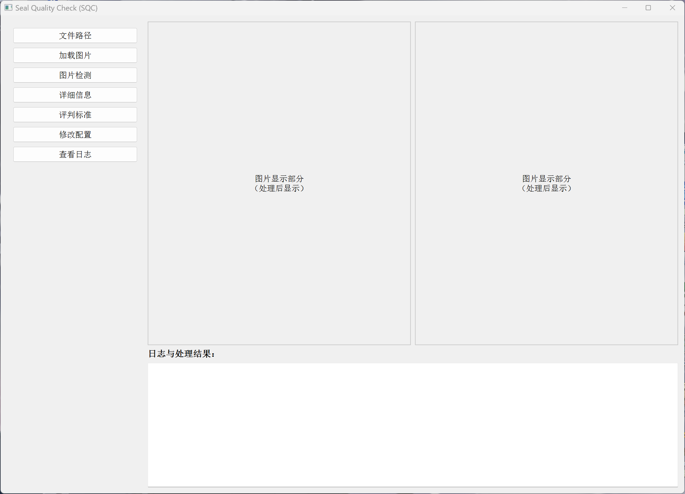
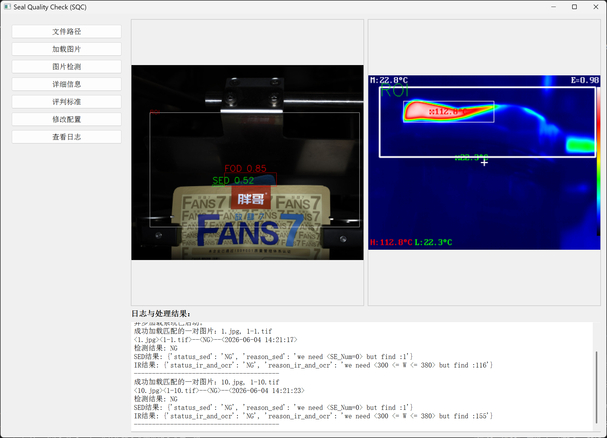

# SealQuakityCheck - 封口质量检测系统(简化版)

基于深度学习的工业封口质量检测系统(简化版)
(去除IO模块,模拟相机)

## 功能特性

- 红外图像缺陷检测
- 语义分割（ResNet18-U-Net）
- 银边与异物检测（YOLOv8）
- OCR字符识别（模版匹配）
- GUI图形界面

## 系统界面



## 检测结果示例



## 安装依赖

```bash
pip install -r requirements.txt
